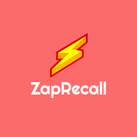
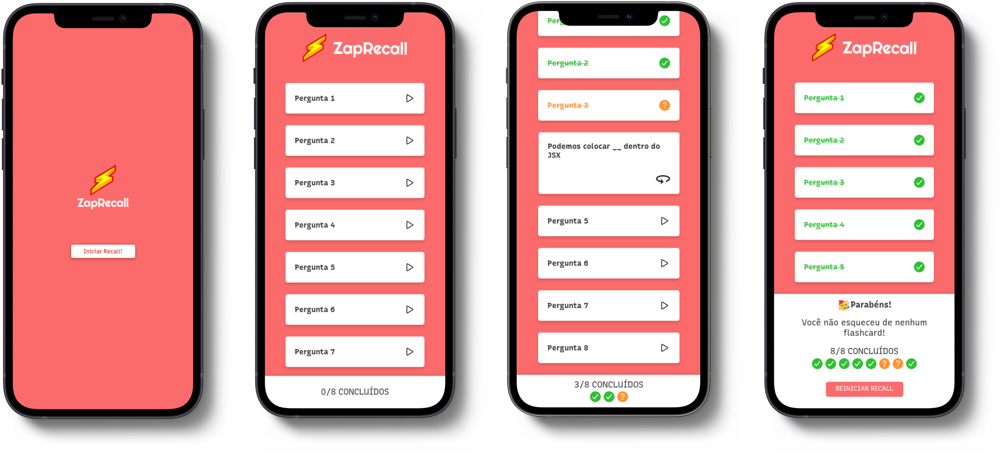

<p align="center">
  <a href="https://projeto8-zaprecall-lac.vercel.app/">
 </a>
</p>

<h3 align="center">Zaprecall</h3>

<div align="center">

[]()
[](https://github.com//raferdev/zaprecall/issues)
[](https://github.com/raferdev/zaprecall/pulls)
[](/LICENSE)

</div>

---



---
<p align="center"> This is a ReactJS project, is based on learning methods which use cards questions to reinforce program languages content.
</p>

## 📝 Table of Contents

- [About](#about)
- [Getting Started](#getting_started)
- [Usage](#usage)
- [Built Using](#built_using)
- [Authors](#authors)

## 🧐 About <a name = "about"></a>

This project i use to training the ReactJS. Is one web app to trainning contents about program languages, use cards with questions about your target diciplines to fix your learning.

## 🏁 Getting Started <a name = "getting_started"></a>

You can clone the project and start on your local host or open the site hospeded <a href="https://projeto8-zaprecall-lac.vercel.app/">here</a>

Clone

 ```
 git clone https://github.com/raferdev/zaprecall
 ```
Install Dependencies


```
npm i
```
Start Server
```
npm start
```
The browser will remote open on the local link on port 3000 (usually). Exemple .:
```
http://localhost:3000
```

## 🎈 Usage <a name="usage"></a>

- Click on 'Iniciar Recall' to play with the cards.
- Click on one card to see the question, next tink about the answer and click again.
- If you remenber the correct answer click on 'Zap!', if you almost didn't get it right you should click on 'Quase não lembrei', and if you don't remember you should click on 'Não lembrei'.
- In the end, when all the cards are answered, you will see one message in the bottom of the page which change with the relation of the three possibilities of answers.
- You can restart and try again.

## ⛏️ Built Using <a name = "built_using"></a>

- [HTML](https://developer.mozilla.org/pt-BR/docs/Web/HTML) - Markup Language
- [CSS](https://developer.mozilla.org/pt-BR/docs/Web/CSS) - Style Language
- [JS](https://developer.mozilla.org/pt-BR/docs/Web/javascript) - Interative Language
- [ReactJS](https://pt-br.reactjs.org/) - Javascript Super Library

## ✍️ Authors <a name = "authors"></a>

- [@raferdev](https://github.com/raferdev)
